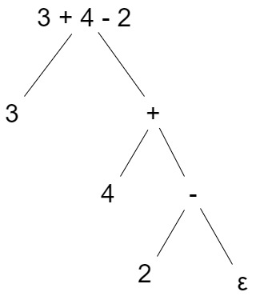

# Trabalho Compiladores

Trabalho da matéria compiladores ministrada pelo professor André Lúcio na Universidade Veiga de Almeida.

---

## Objetivo do trabalho

Realizar um programa que seja capaz de fazer a tradução e análise léxica de um código fonte.

---

### Análise Léxica

É o processo que verifica se uma palavra é aceita pela linguagem e separa as palavras aceitas em Tokens.

Exemplo a expressão

```
3 + 4 - 2
```

Ele vai verificar se cada um dos elementos da expressão existe dentro do dicionário da linguagem e separar eles, assim ficando.

```
[3] [+] [4] [-] [2]
```


---

### Tradução

É o processo que vai organizar os Tokens em uma string para a operação ser mandada para o Backend realizar a operação em ordem.

A tradução foi feita usando a fórmula ensinada em sala de aula para evitar *recursão a esquerda*

**Recusão a esquerda**

A técnica que utilizaremos para eliminar a recursão a esquerda é bem simples.

```
expr ⭢ expr + term {print('+')}
    |  expr - term {print('-')}
    | term
```

Iremos converter a expressão para uma linguagem formal para explicar.

Gramática com recursão a esquerda 
```
A ⭢ Aα | Aβ  ⭢ γR
    | Aβ | R ⭢ αR 
    | γ ⭢ ε


A = expr
α = term {print('+')}
β = term {print('-')}
γ = term
```
Gramática sem recursão a esquerda 
```
A ⭢ γR
R ⭢ αR | βR | ε

A = expr
α = term {print('+')}
β = term {print('-')}
γ = term
```

Retiraremos a possibilidade de Loop infinito usando o algoritmo para retirar a recursão a esquerda.

No exemplo dado a cima ele vai organizar em uma árvore de operações como na imagem a seguir.



A árvore sempre percorre indo para o Nó mais a esquerda primeiro e depois imprimindo o seu operador, logo a saída será:

```
34+2-
```

---

### Código

A Análise Léxica foi feita utilzando a classe *Lexical* que possui os seguintes metódos.


 ```python
 def look_ahead(self, pos = 0) -> str | None:
 ``` 

- Manda qual vai ser a próxima posição a sera transformada em um Token.

Pos = Caso o  Token seja uma operação como + ou - ele vai enviar o próximo Token.


 ```python
def parse_advance(self):
 ``` 
- Avança para o próximo Token
 
```python
def parse_chop(self) -> str:
``` 
- Envia o próximo Token

```python
def parse_term(self) -> str:
``` 

- Verifica se o Token é um número

---

A tradução foi feita utilzando a classe *Parse* que possui os seguintes metódos.

```python
def parse_expr(self)-> str | None:
``` 

- Vai montar a expressão traduziada

```python
def parse(self, source) -> str:
 ``` 

- Método que vai iniciar a tradução da expressão e retornar uma expressão traduzida para o analisador léxico


Source = Expressão que foi escrita no Source Code

---

### Referências

- AKITA, Fábio Akita, <a href="https://www.youtube.com/watch?v=SNyh-cubxaU">Linguagem Compilada vs Interpretada | Qual é melhor?</a> , 15 de abr. de 2022.

- MONTANO, Lucas Montano, <a href="https://youtu.be/e4x4IITQvak?si=VotB_hN46C94tN0o">Explicando Linguagem Interpretada - FINALMENTE TU VAI ENTENDER</a>, 11 de set. de 2023.
