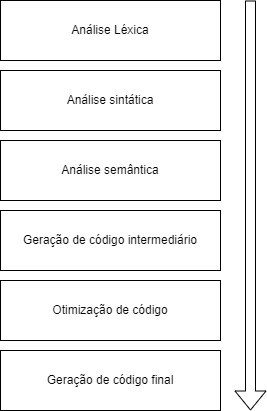
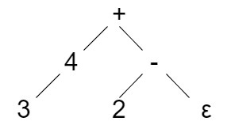

# Processos de Compilação

Podemos definir o processo de compilação pela seguinte imagem.



## Análise Léxica

É o processo que verifica se uma palavra é aceita pela linguagem e separa as palavras aceitas em Tokens.

Exemplo a expressão

```
3 + 4 - 2
```

Ele vai verificar se cada um dos elementos da expressão existe dentro do dicionário da linguagem e separar eles, assim ficando.

```
[3] [+] [4] [-] [2]
```


## Análise Sintática

É o processo que vai organizar os Tokens em uma arvoré/string para a operação ser mandada para o Backend realizar a operação em ordem.

    A tradução deve ser capaz de recusar Tokens inválidos.

A tradução foi feita usando a fórmula ensinada em sala de aula para evitar *recursão a esquerda*

### Recusão a esquerda

A técnica que utilizaremos para eliminar a recursão a esquerda é bem simples.

```
expr ⭢ expr + term {print('+')}
    |  expr - term {print('-')}
    | term
```

Iremos converter a expressão para uma linguagem formal para explicar.

Gramática com recursão a esquerda 
```
A ⭢ Aα | Aβ  ⭢ γR
    | Aβ | R ⭢ αR 
    | γ ⭢ ε


A = expr
α = term {print('+')}
β = term {print('-')}
γ = term
```
Gramática sem recursão a esquerda 
```
A ⭢ γR
R ⭢ αR | βR | ε

A = expr
α = term {print('+')}
β = term {print('-')}
γ = term
```

Retiraremos a possibilidade de Loop infinito usando o algoritmo para retirar a recursão a esquerda.

No exemplo dado a cima ele vai organizar em uma árvore de operações como na imagem a seguir.



A árvore sempre percorre indo para o Nó mais a esquerda primeiro e depois imprimindo o seu operador, logo a saída será:

```
34+2-
```

## Analise Semântica